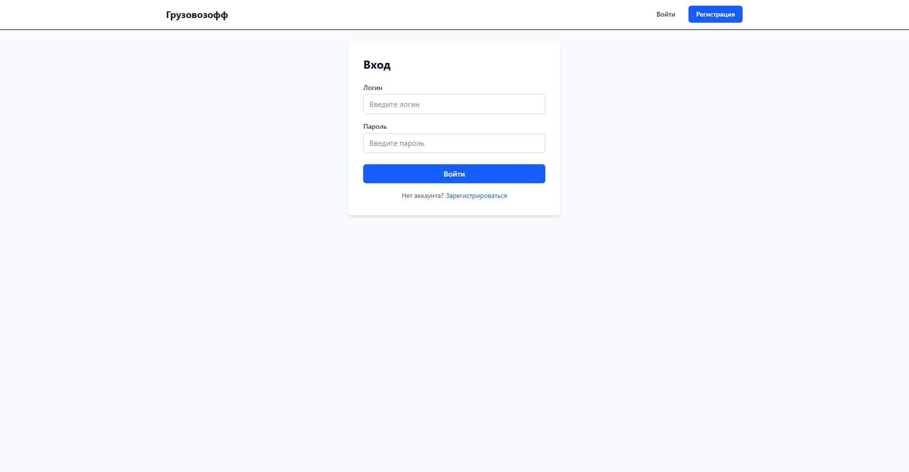
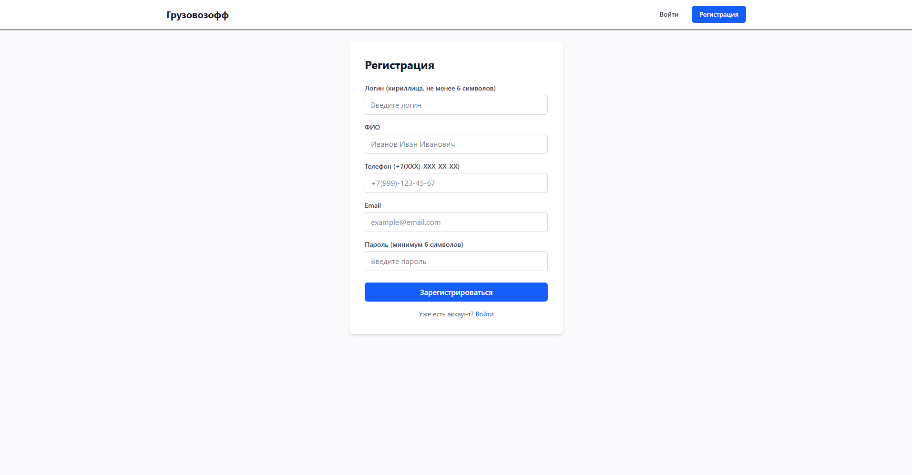
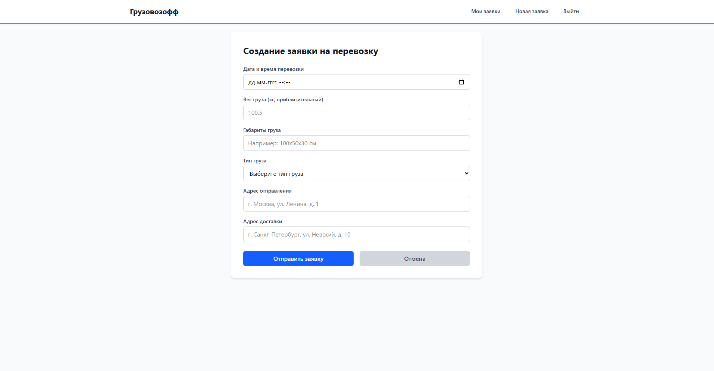
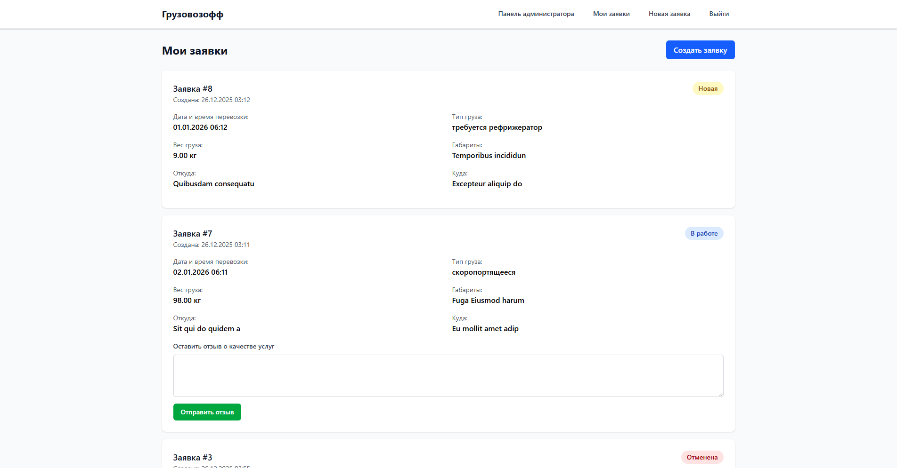
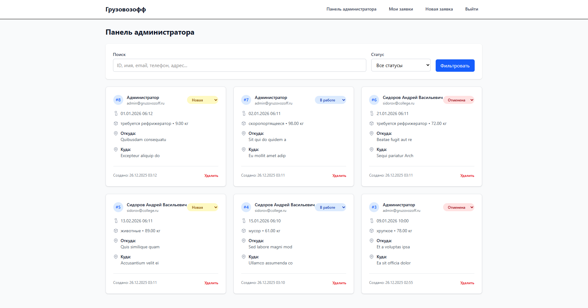
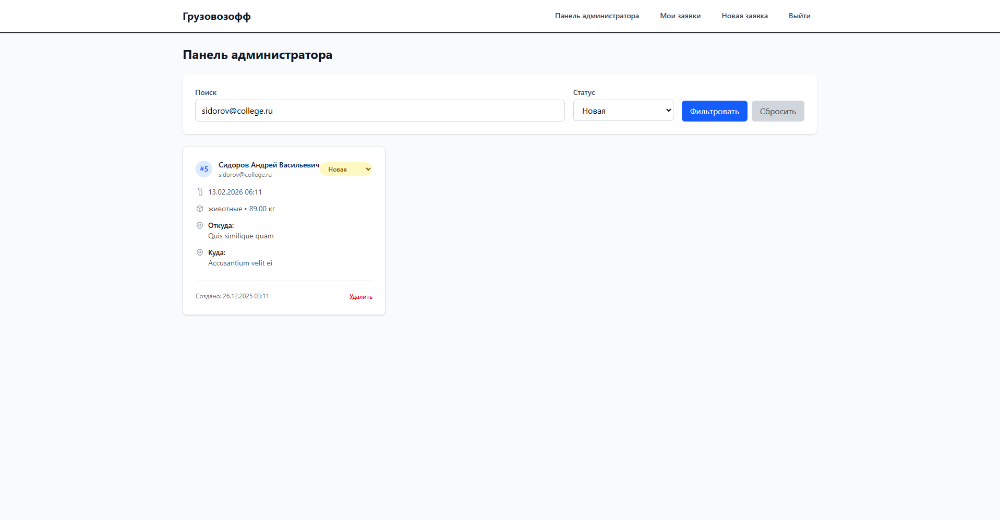
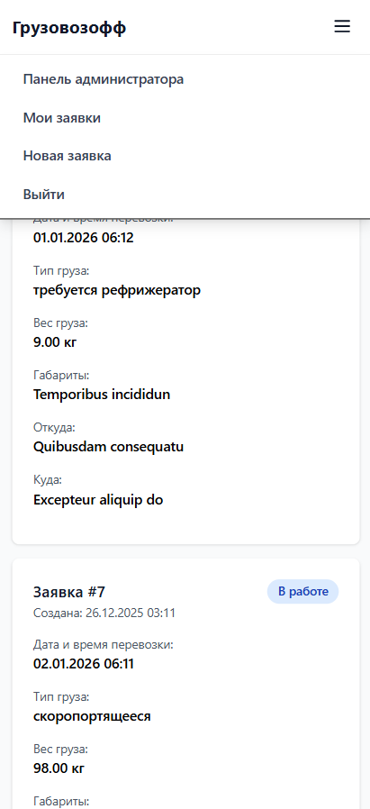

# 🚚 Грузовозофф

Система управления заявками на грузоперевозки - веб-приложение для создания заявок на перевозку грузов с административной панелью.

<!-- 📸 СКРИНШОТ: Главная страница -->


## 📋 О проекте

Проект представляет собой информационную систему для портала грузоперевозок. Система позволяет пользователям регистрироваться, создавать заявки на перевозку с указанием всех необходимых данных, а администраторам - управлять заявками, изменять их статусы и фильтровать по различным параметрам.

### Основные возможности

- ✅ **Регистрация и авторизация пользователей** с валидацией данных
- ✅ **Создание заявок на перевозку** с полной информацией о грузе и маршруте
- ✅ **Административная панель** для управления заявками
- ✅ **Фильтрация и поиск** заявок по статусу, имени, email, телефону, адресам
- ✅ **Изменение статусов заявок** (Новая, В работе, Отменена)
- ✅ **Адаптивный дизайн** для мобильных устройств и десктопов
- ✅ **Система отзывов** после завершения работы
- ✅ **Пагинация** для удобной навигации

## 🛠 Технологии

- **Backend:**
  - PHP 8.1+
  - Laravel 10+
  - SQLite
  
- **Frontend:**
  - Tailwind CSS
  - JavaScript (Vanilla)
  - Blade Templates
  
- **Инструменты:**
  - Vite
  - Composer
  - npm

## 📦 Установка

### Требования

- PHP >= 8.1
- Composer
- Node.js >= 16
- SQLite

### Шаги установки

1. **Клонируйте репозиторий:**
```bash
git clone https://github.com/markup-dev/gruzovozoff.git
cd gruzovozoff
```

2. **Установите зависимости PHP:**
```bash
composer install
```

3. **Установите зависимости Node.js:**
```bash
npm install
```

4. **Настройте окружение:**
   - Создайте `.env` файл в корне проекта
   - Настройте подключение к БД в `.env`:
```env
DB_CONNECTION=sqlite
DB_DATABASE=/absolute/path/to/database.sqlite
```

5. **Сгенерируйте ключ приложения:**
```bash
php artisan key:generate
```

6. **Создайте базу данных:**
```bash
touch database/database.sqlite
php artisan migrate
```

7. **Соберите фронтенд-ресурсы:**
```bash
npm run build
```

8. **Запустите сервер разработки:**
```bash
php artisan serve
```

Приложение будет доступно по адресу: `http://127.0.0.1:8000`

## 👤 Учетные данные

### Администратор
- **Логин:** `admin`
- **Пароль:** `gruzovik2024`

## 🎯 Использование

### Для пользователей

1. **Регистрация:**
   - Перейдите на страницу регистрации
   - Заполните все обязательные поля

<!-- 📸 СКРИНШОТ: Страница регистрации -->


2. **Создание заявки:**
   - После авторизации нажмите "Создать заявку"
   - Заполните форму с информацией о грузе и маршруте

<!-- 📸 СКРИНШОТ: Форма создания заявки -->


3. **Просмотр заявок:**
   - В разделе "Мои заявки" отображаются все ваши заявки
   - Можно оставить отзыв после завершения работы

<!-- 📸 СКРИНШОТ: Список заявок пользователя -->


### Для администраторов

1. **Вход в панель администратора:**
   - Войдите с учетными данными администратора
   - Откроется карточная панель с заявками

<!-- 📸 СКРИНШОТ: Панель администратора -->


2. **Фильтрация заявок:**
   - Используйте поиск по ID, имени, email, телефону, адресам
   - Фильтруйте по статусу: Все, Новая, В работе, Отменена
   - Фильтры применяются автоматически

<!-- 📸 СКРИНШОТ: Фильтрация заявок -->


3. **Изменение статуса заявки:**
   - Выберите новый статус из выпадающего списка
   - Изменения сохраняются автоматически

## 📱 Мобильная версия

Система полностью адаптивна и оптимизирована для мобильных устройств.

<!-- 📸 СКРИНШОТ: Мобильная версия -->


## 🔒 Безопасность

- Хеширование паролей (bcrypt)
- Защита от CSRF-атак
- Валидация всех входных данных
- Middleware для проверки авторизации
- Защита маршрутов администратора

### Функциональность

- **Отзывы только после завершения работы**
- **Глобальный поиск** по множественным полям
- **Фильтрация в реальном времени**
- **Автоматическое изменение статусов**

## 👨‍💻 Автор

Проект выполнен в рамках обучения.
